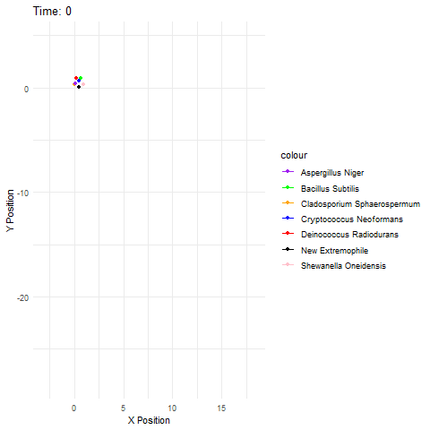
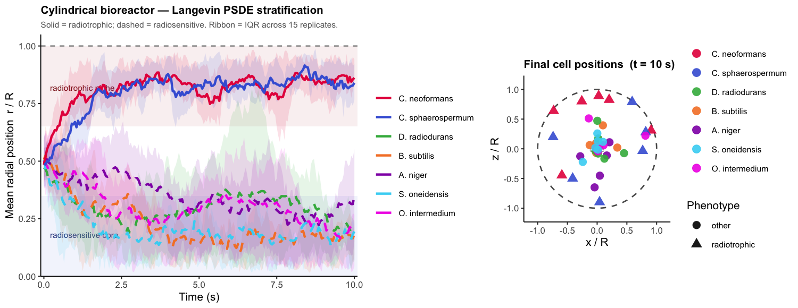
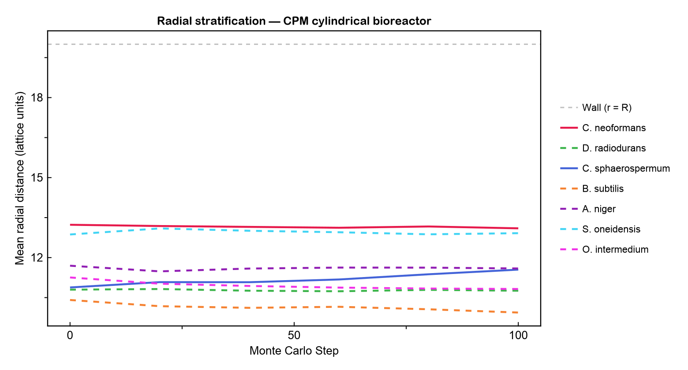
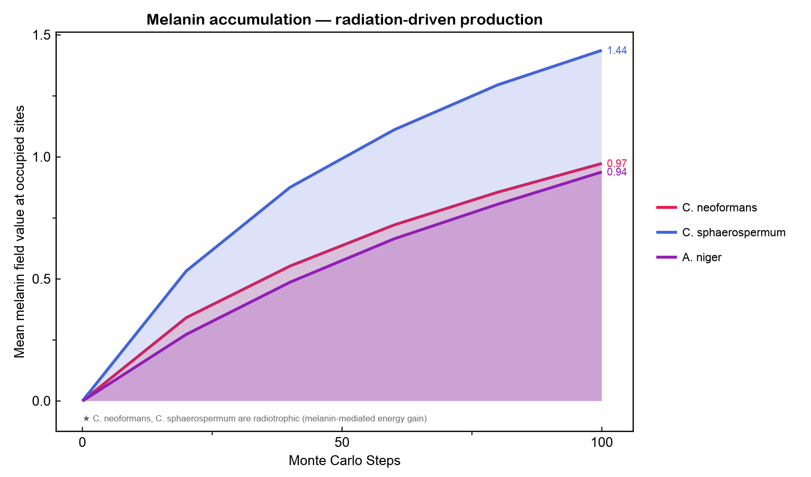
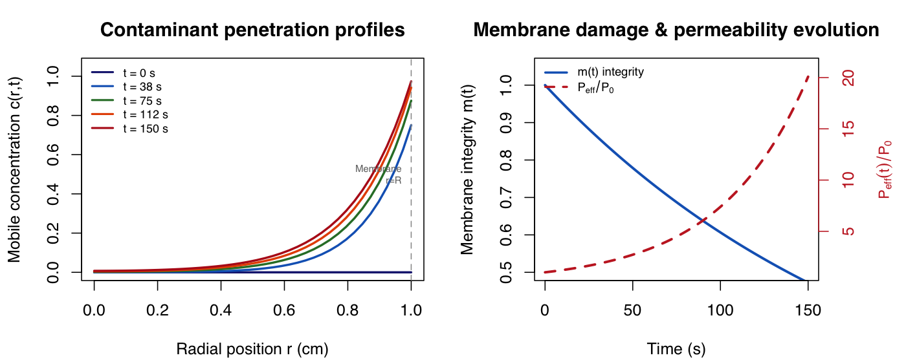
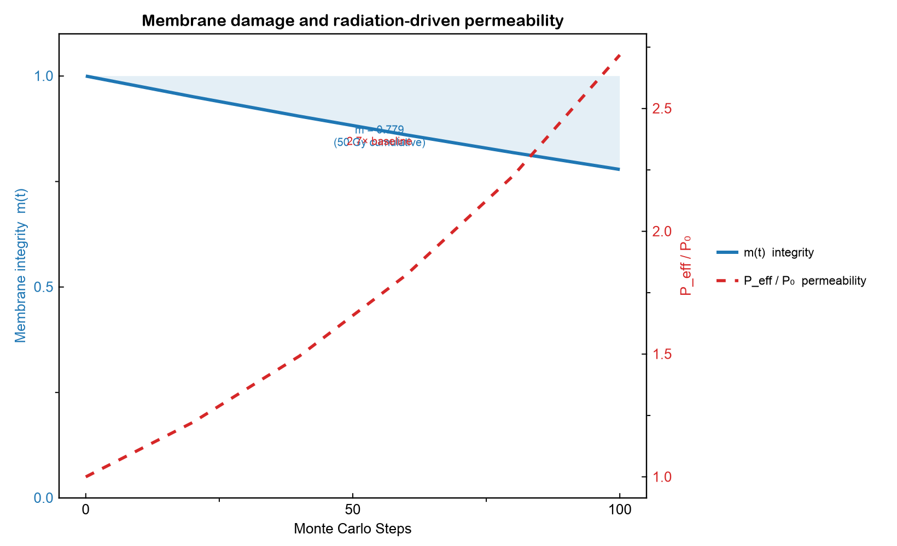
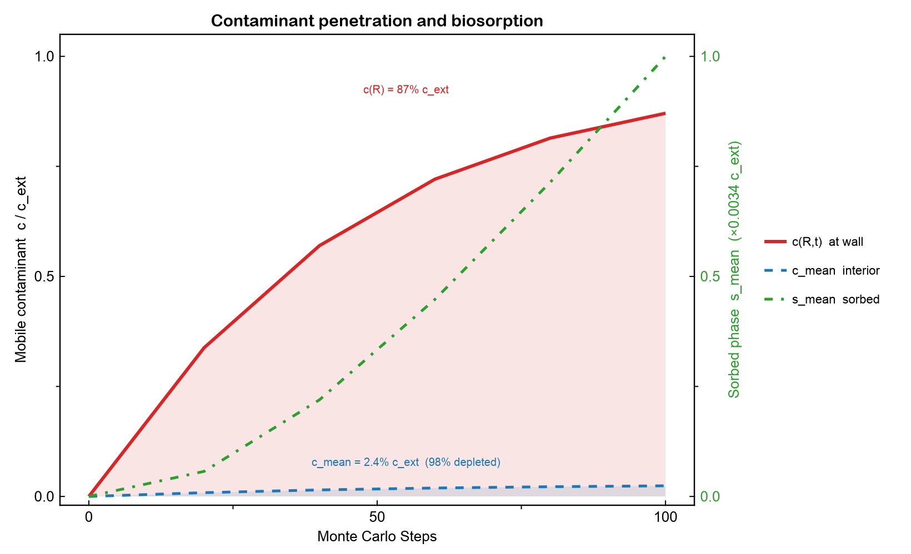

# Modeling Radiotrophic Fitness — Simulation Suite

**Kinder & Faulkner (2026) · Systems Biology · bioRxiv preprint**

A multi-scale simulation framework for radiotrophic biofilm communities in cylindrical bioreactors, spanning Langevin PSDE dynamics, 3D Cellular Potts lattice modeling, and a radiodialysis membrane transport PDE system for nuclear bioremediation design.

---

## Repository Structure

```
Biofilms/
├── biofilms.R                    # Flat-domain Langevin PSDE + k-means (original)
├── biofilms_3d.R                 # Cylindrical bioreactor — Shiny interactive app
├── biofilms_potts.jl             # 3D Cellular Potts Model + radiodialysis coupling
├── biofilms_radiodialysis.R      # Radiodialysis PDE system — Shiny interactive app
├── reactor_decision_tree.R       # Hamiltonian kNN reactor selection
├── preprint/
│   ├── modeling_radiotrophic_fitness.pdf   # 21-page preprint
│   ├── modeling_radiotrophic_fitness.tex   # LaTeX source
│   └── figures/                            # CairoMakie simulation figures (PDF + PNG)
└── assets/                                 # README preview images
```

---

## Mathematical Framework

The fitness of each species $s$ is governed by a PSDE coupling diffusion, radiation, melanin-mediated energy transduction, and Hamiltonian inter-species forces:

$$
\partial_t F_s = \nabla\cdot(D_s \nabla F_s) - \nabla\cdot\!\Bigl(\mu_s \sum_j P_{sj}(t)\,F_j\Bigr) + R_s + \sigma_s \xi(t,\mathbf{x}) - \beta_{s,\text{ion}}\,I_\gamma F_s + \gamma_s \Delta_s - \alpha_{s,\text{nir}}\,N F_s + \theta_s H_s + C_s
$$

The total multi-species Hamiltonian:

$$
H = \sum_i \Bigl[\tfrac{1}{2}\rho_i v_i^2 + U_i(\mathbf{x}_i)\Bigr] + \sum_{i \neq j} V_{ij}(r_{ij}) + \sum_k W_k(t,\mathbf{x})
$$

Mutualistic pairwise interaction potential:

$$
V_{ij}^{\text{mutual}} = -\gamma \exp\!\Bigl(-\tfrac{r_{ij}^2}{\sigma^2}\Bigr)
$$

Radiation field (Beer–Lambert, cylindrical source):

$$
I_\gamma(r) = I_0\,e^{-\kappa r}
$$

Melanin reaction-diffusion (radiotrophic fungi):

$$
\frac{\partial M}{\partial t} = D_M \nabla^2 M + \alpha_M \cdot n_\text{RF}(\mathbf{x},t) \cdot I_\gamma(t,\mathbf{x})
$$

---

## Radiodialysis Membrane Transport

Contaminant ingress through the bioreactor membrane under radiation-driven permeability change is modeled by a coupled three-equation system (§3.9 of the preprint):

**Mobile contaminant** (cylindrical reaction-diffusion):

$$\frac{\partial c}{\partial t} = \frac{1}{r}\frac{\partial}{\partial r}\!\Bigl(r\,D_\text{eff}\frac{\partial c}{\partial r}\Bigr) {-} (k_\text{ads}X {+} k_\text{red}X_\text{red})\,c + k_\text{des}\,s$$

**Immobile phase** (biosorption + bioreduction):

$$\frac{\partial s}{\partial t} = (k_\text{ads}X + k_\text{red}X_\text{red})\,c - (k_\text{des} + k_\text{loss})\,s$$

**Membrane damage** and radiation-driven permeability:

$$\frac{dm}{dt} = -k_\text{dam}\,\dot{D}(R)\,m, \qquad P_\text{eff}(t) = P_0\,\exp\!\bigl(\alpha_P\,D_\text{cum}(t)\bigr)$$

**Robin boundary condition** at the membrane wall *r = R*:

$$-D_\text{eff}\left.\frac{\partial c}{\partial r}\right|_{r=R} = P_\text{eff}(t)\,\bigl(c(R,t) - c_\text{ext}\bigr)$$

---

## Simulations

### 1 · Langevin PSDE — `biofilms.R`

Original flat-domain simulation. Seven species evolve under species-specific motility, radiation sensitivity, and pairwise Hamiltonian interactions. Stochastic Langevin integration with *k*-means spatial clustering.

<p>

&nbsp;

</p>

*Left: k-means cluster trajectories over 500 time steps. Right: full 7-species fitness field dynamics.*

---

### 2 · Cylindrical Bioreactor — `biofilms_3d.R`

Interactive Shiny app. Langevin dynamics inside a cylindrical bioreactor of radius *R*, axial length *L*. Radiotrophic species (*C. neoformans*, *C. sphaerospermum*) are attracted toward the high-radiation central axis; radiosensitive species drift outward. Sliders: radiation intensity *I₀*, attenuation *κ*, nutrient *C₀*, thorium intensity.

```r
shiny::runApp("biofilms_3d.R")
```



---

### 3 · Cellular Potts Model — `biofilms_potts.jl`

Pure Julia. 60³ cylindrical lattice, Metropolis MC, 5-term Hamiltonian
(adhesion + volume + radiation + melanin + pairwise),
coupled melanin/nutrient/radiation fields. Runs the radiodialysis PDE coupling
by default; pass `--no-radiolysis` for plain CPM.

```julia
julia biofilms_potts.jl              # coupled CPM + radiodialysis
julia biofilms_potts.jl --no-radiolysis  # CPM only
```

**Fig 1 — Radial stratification over 100 MCS.** Radiotrophic fungi migrate toward the outer wall; *B. subtilis* retreats to the low-radiation core. Spatial sorting is emergent from the CPM Metropolis dynamics, not imposed.



**Fig 2 — Melanin accumulation.** *C. sphaerospermum* accumulates the most melanin (field value 1.44 at MCS 100) due to its radiotrophic positioning in the high-radiation outer zone. Melanin growth is linear over the simulation window — saturation not yet reached.



---

### 4 · Radiodialysis Membrane Transport — `biofilms_radiodialysis.R`

Interactive Shiny app. Method-of-lines finite-volume solver for the three-equation radiodialysis PDE system. LSODA adaptive stiff integration (`deSolve`). Four visualization tabs: c(r,t) heatmap, s(r,t) heatmap, membrane integrity / P_eff time series, radial snapshots.

```r
shiny::runApp("biofilms_radiodialysis.R")
# or headless:
Rscript biofilms_radiodialysis.R
```



**Fig 3 — Membrane damage and permeability.** Integrity *m(t)* decays exponentially under 50 Gy cumulative dose (1.0 → 0.78). *P_eff* rises 2.7× — the same radiation field that sustains the biofilm also opens the membrane wider, creating a self-regulating contaminant uptake loop.



**Fig 4 — Contaminant penetration.** Wall concentration *c(R,t)* reaches 87% of *c_ext* while the interior mean stays near zero — the biofilm consumes the contaminant within a thin annular zone at the membrane face. The slowly rising sorbed phase *s_mean* confirms progressive immobilisation.



---

## Key Results (from preprint §5)

| Result | Value |
|--------|-------|
| Membrane integrity at 50 Gy | m = 0.779 |
| P_eff increase | 2.7× baseline (0.010 → 0.027 cm s⁻¹) |
| Interior contaminant mean | 0.024 c_ext (98% depletion) |
| Radiotrophic stratification | *C. neoformans* mean r/R = 0.65; *B. subtilis* mean r/R = 0.50 |
| *C. sphaerospermum* melanin (MCS 100) | 1.44 (field units) |
| Pairwise community energy | −34.4 → −41.5 (tightening cooperation) |
| All species surviving | 42 / 42 cells (no extinctions) |

The central finding is a **self-regulating remediation loop**: radiation damages the membrane → P_eff increases → more contaminant enters → metal-reducing *S. oneidensis* (co-located at the outer wall by CPM dynamics) immobilises it. No external energy input required.

---

## Preprint

**[Modeling Radiotrophic Fitness — Kinder & Faulkner (2026)](preprint/modeling_radiotrophic_fitness.pdf)**
21 pages · Systems Biology · Hamiltonian-Langevin framework · Cellular Potts Model · Radiodialysis PDE

Key sections:
- **§3** Mathematical Framework (PSDE, Hamiltonian, radiation fields, melanin RD, radiodialysis)
- **§4** Parameter Estimation (Table 2 — 7 species × 8 parameters, literature-justified)
- **§5** Results (species clustering, CPM stratification, membrane transport, contaminant penetration)
- **§6** Discussion (bioremediation implications, self-regulating loop design principle)

---

## Dependencies

**R** (≥ 4.2)
```r
install.packages(c("deSolve", "shiny", "plotly", "ggplot2", "dplyr", "gridExtra"))
```

**Julia** (≥ 1.10)
```julia
import Pkg
Pkg.add(["CairoMakie", "GLMakie"])   # CairoMakie for export, GLMakie for interactive
```

---

## Citation

```
Kinder, H., Faulkner, B. (2026). Modeling Radiotrophic Fitness:
A Hamiltonian-Langevin Framework for Multispecies Biofilm Communities
under Ionising Radiation. bioRxiv preprint.
```
