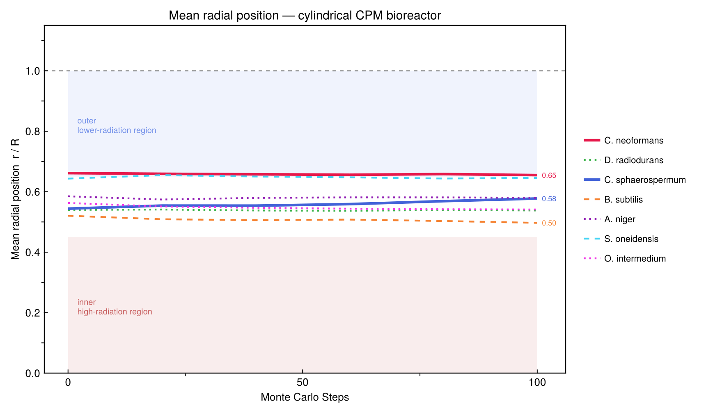
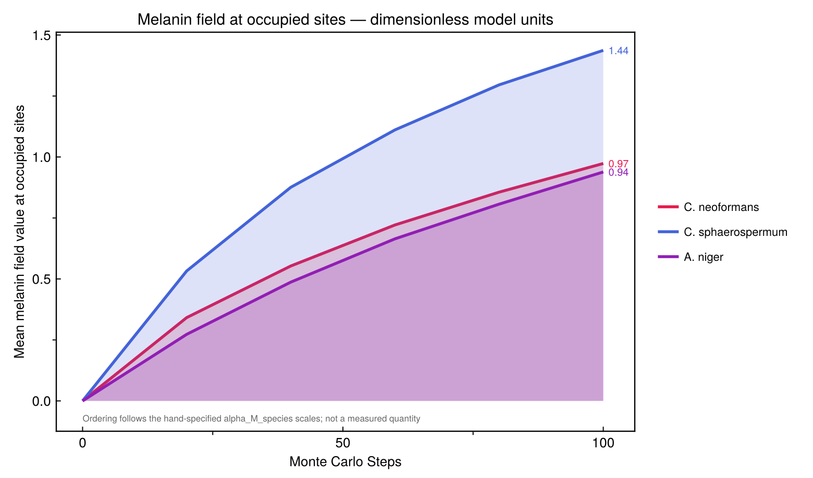
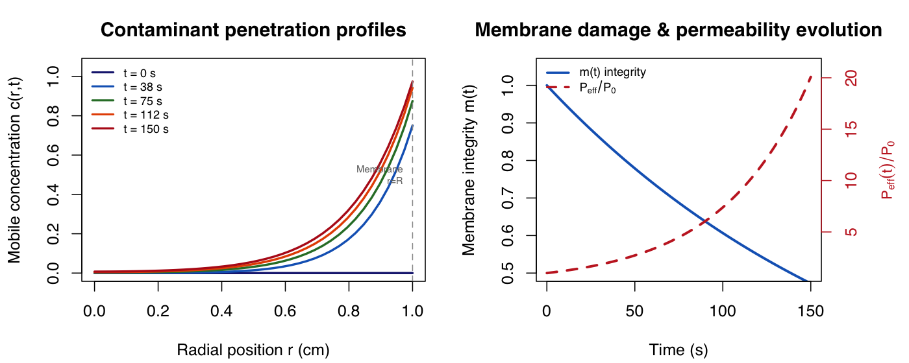
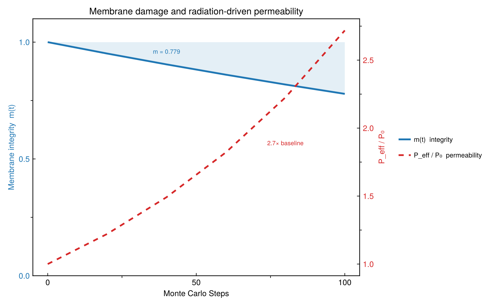
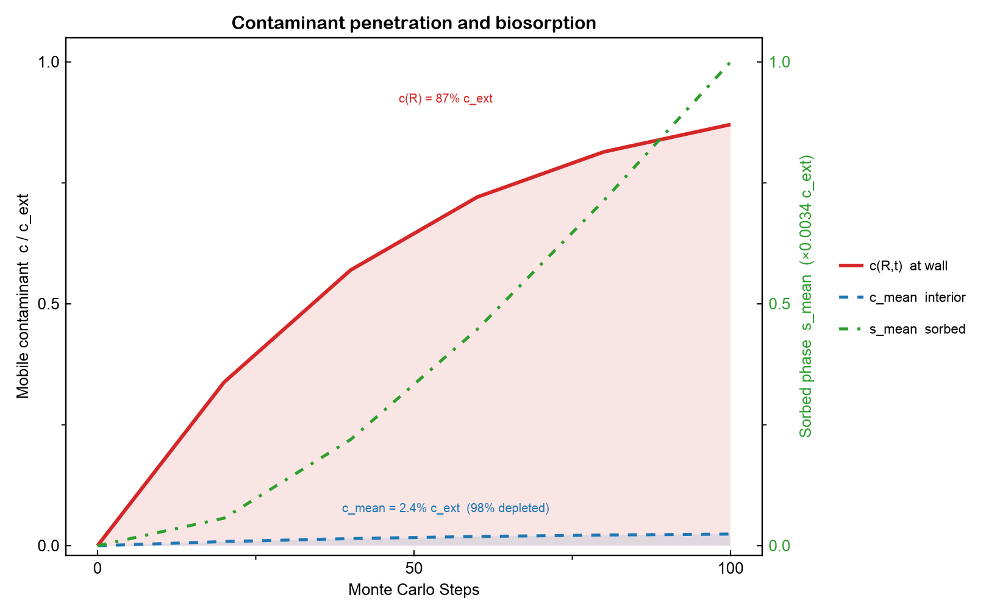
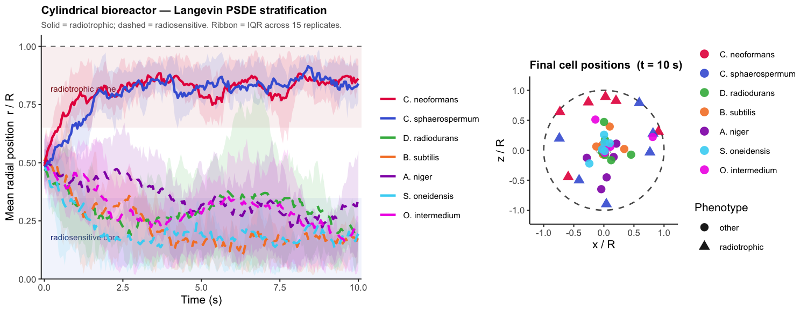
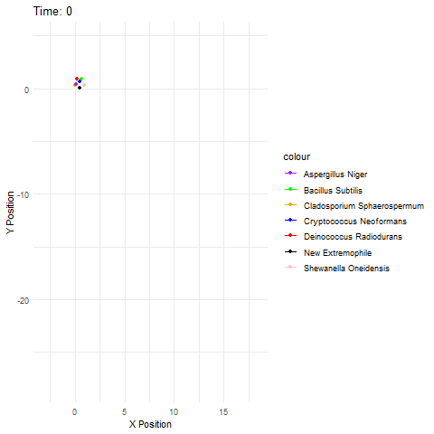

# Modeling Radioresistance and Radiotropic Fitness — Simulation Suite

**Kinder & Faulkner** · manuscript draft, not submitted · branch `research/observable-split-and-pilot-hardening`

## What this is

A mechanistic modelling framework for a seven-species biofilm community under ionising radiation,
plus the calibration and transport machinery that decides what the framework is allowed to claim.

Four things run. A **3D Cellular Potts model** (`biofilms_potts.jl`) evolves biomass parcels on a
cylindrical lattice under a four-term Metropolis acceptance functional — adhesion, volume, radiation
and melanin — with a static radial radiation field and a genuinely two-way melanin field. A
**cylindrical radiodialysis transport model** (`biofilms_radiodialysis.R`, and a second
implementation inside the CPM) solves a three-equation contaminant/sorbate/membrane system in which
**membrane permeability is a dose-driven field rather than a fixed material constant** — the most
interesting mechanism in the repository. An **OpenMC photon-transport path** (`coupling/`) builds
transport models from a lattice snapshot, tallies heating, converts it to absorbed dose and
attributes that dose to lineage labels. A **calibration layer** (`calibration/`) gates all three, and
currently refuses to emit a single physical unit.

```julia
julia --project=. biofilms_potts.jl    # coupled CPM + radiodialysis, N = 40, 100 MCS, seed 42
```

(That command's previous open defect — an undeclared `CairoMakie` dependency — is fixed; see
[Dependencies](#dependencies).)

The framework is **uncalibrated**. Its parameters are literature priors and declared model inputs.
No lattice pitch, no seconds-per-Monte-Carlo-step and no material density has been selected, and no
output has been compared to a measurement of a target system. Every simulation number below is
reported in the dimensionless model units it was computed in.

On the manuscript's status: web searches on both 2026-08-15 and 2026-08-24 found **no record of a
bioRxiv posting**, and no DOI appears anywhere in the repository. Treat it as unposted — that is a
search result, not proof. (Its predecessor, the superseded `modeling_radiotrophic_fitness.md`, had
a closing "Notation Fixes Required Before Submission" section; the current, revised
`.tex` — the source of record — has no such section and no unresolved notation issues.)

---

## Which radiation phenotype this model represents

Five phenomena travel under one loose word and they are not interchangeable. A survival curve cannot
calibrate a directional term. The full argument is in `docs/calibration/integration_contract.md`.

| Phenotype | What it means | Represented here? |
|---|---|---|
| **radiotropic** | directional redistribution toward or away from a source | **yes** — this is `response.hamiltonian` |
| radiotrophic | radiation measurably **enhances growth or metabolism** | **no** — requires growth, and there is none |
| radioresistant | elevated **survival** after exposure | **no** — requires death, and there is none |
| melanized_radioprotective | melanin measurably alters damage, survival or shielding | no — requires damage |
| radiation_responsive | molecular, morphological or material change after exposure | partly — `response.melanin` |

`compute_delta_H` adds `β_ion[s]·I_γ` when a parcel **gains** a site, so a negative `β_ion` lowers
the acceptance functional in high-dose sites and the parcel drifts up the gradient. That is a
**tropism**. It was previously labelled "metabolic energy gain", which conflates a Metropolis
acceptance functional in arbitrary units with an energy budget; the model creates no biomass for such
a gain to act on.

Radiotrophy and radioresistance are therefore **structurally absent** here, for the same reason
`response.growth_survival` is `unsupported_by_current_model`. They are not weakly supported. A model
with no birth and no death cannot express either, and no quantity of data changes that without a
model revision.

This has a consequence worth stating plainly: the published D10 evidence — which is strong, and is
what anchors the per-species `β_ion` magnitudes — is **radioresistance evidence being spent on a
tropism coefficient**. That substitution is legitimate as a declared modelling choice, and it is now
declared rather than left implicit in a sign convention. The constant is `RADIOTROPIC` in
`biofilms_potts.jl:49`, renamed from `RADIOTROPHIC`; `biofilms_3d.R`'s species flag likewise.

---

## The finding: the tropism is melanin-mediated, not `β_ion`-mediated

This is the most interesting single result in the repository, and it is a self-audit finding rather
than a simulation output. At the shipped constants `I0 = 1.0` and `T_cpm = 5.0`:

| Term | ΔH | Metropolis acceptance bias |
|---|---|---|
| `ΔH_rad`, radiotropic species (β = −5e−5) | −5.0e−5 | 1.000010 |
| `ΔH_rad`, most radiosensitive species (β = 7.5e−2) | +7.5e−2 | 0.985 |
| `ΔH_mel` at the reported M = 1.44 | −0.720 | **1.155** |

`β_ion` — the one parameter Table 2 tabulates per species, and the one the entire sign convention is
written around — biases acceptance by **one part in 10⁵** *for one role of the two negatively
signed species occupying a site*, which is not the term's reach: signed by role it reaches
7.505e-2. The melanin term biases acceptance by **15.5%**, larger by about an order of
magnitude (9.6 in ΔH), through a coefficient of `0.5` hard-coded at its call site in `compute_delta_H`,
appearing in no table and in no configuration file.

Radiation still reaches the dynamics. It reaches them **indirectly**, because `melanin_drive` is
copied from the radiation field:

```
radiation → production (α_M, tabulated) → M → ΔH_mel (0.5, untabulated) → tropism
```

Two consequences. A sensitivity analysis over `β_ion` would report the radiation response as
negligible — right about the coefficient, wrong about the mechanism. And only the **product**
`α_M · k` reaches the dynamics, so `cpm.melanin_coupling` and `response.melanin` are jointly
identifiable at best and never separately. The coefficient is now ledgered as `cpm.melanin_coupling`
in `data/parameter_provenance.csv` with `status=blocked` and `sensitivity_rank=high`. It is one of
five rows in that ledger not ranked `unknown`, and the only one outside the A0 transport sweep — the
other four (`transport.mesh.base_dimension`, `transport.mesh.coarsening_factor`, `transport.batches`,
`transport.particles`) were ranked by that sweep and carry `sensitivity_domain =
transport_numerical`, which is a numerical-convergence rank and not a biological one. Every
biological-response row in the ledger is still `unknown`, because no sensitivity analysis has been
run over any of them; this one was measured by hand.

For scale: adhesion differences in the hand-specified `J` matrix are O(4–20) per neighbour pair, so
`ΔH_adh` remains the largest term and still sets the sorting structure. The ordering is
adhesion ≫ melanin ≫ radiation.

---

## What this repository cannot currently claim

Each refusal below is enforced in code and pinned by a test. None of them is a caveat added in prose.

| Not claimable | Why | What would clear it | Where enforced |
|---|---|---|---|
| Any length in µm or cm | **No lattice pitch is selected.** A pitch is *not identifiable* from a cell volume alone: `V_physical = V_sites · a³` constrains only a product. `select_pitch()` refuses without declared tolerances, refuses when any tolerance is unset, and refuses when no evaluation is marked held-out. An undeclared tolerance is never read as infinitely permissive. | A calibrated 3-D stack of a target system with a genuine held-out acquisition, plus populated tolerances in `config/cpm_spatial_acceptance_template.toml`. | `docs/calibration/cpm_spatial_calibration.md`, `calibration/biofilm_calibration/spatial/pitch_selection.py` |
| Any duration in seconds, or any dose in Gy | **No seconds/MCS conversion exists.** `CPMParams.seconds_per_mcs` ships `NaN` and `accrue_dose!` raises rather than run without it. The repository has two independent clocks — MCS count and radiodialysis seconds — with no declared conversion. | The dynamic observable is already selected (`biomass_autocorrelation_decay`, status `provisional`). `dt_MCS = a² · S_sim / S_exp` still needs a pitch, so this is blocked on the *other* half. | `docs/calibration/time_observable_contract.md`, `data/calibration/spatial/time_observable.csv`, `biofilms_potts.jl` |
| Any mass, concentration, or `g cm⁻³` | **No wet bulk density and no closed elemental composition.** `data/calibration/voxel_binding.csv` carries both numeric fields blank; blank means NOT MEASURED and is never read as zero. `wet_bulk_density()` raises when a wet mass is divided by a `cells_only` volume. | Replicate wet and dry mass with matched hydrated and dry blanks, a hydrated volume on a `whole_biofilm_envelope` basis, ash, and CHNS + ICP closing to 1 on a wet-bulk basis — on one specimen under one condition. | `docs/calibration/material_basis_contract.md`, `calibration/biofilm_calibration/materials/` |
| Growth, division, survival, or extinction | **`response.growth_survival` is unfittable in principle**, not merely unmeasured: the CPM has no growth dynamics and `divide_cell!` has no trigger. | **A model change.** No quantity of data clears it. | `docs/calibration/integration_contract.md`, `calibration/biofilm_calibration/schema.py` |
| Anything per cell | **One CPM cell ID is a computational biomass parcel**, with `literal_generation_claim_allowed = false` for all seven species. Reading a parcel-volume distribution as a cell-size distribution, or comparing parcel counts to colony-forming units, is refused. | A model in which one ID is one organism — again a model change, not data. | `docs/calibration/cpm_entity_semantics.md`, `data/calibration/spatial/entity_semantics.csv` |
| A per-organism spatial prediction for *B. subtilis*, *C. sphaerospermum* or *A. niger* | **Three of the seven species have morphologies the model cannot hold at any pitch** — rods and filaments need surface-area, elongation and connectivity terms `compute_delta_H` does not have. Verdict: `MODEL_REVISION_REQUIRED`. | Those terms. | `docs/calibration/cpm_spatial_calibration.md`, `calibration/biofilm_calibration/spatial/representability.py` |
| A physical apparatus | Nothing here defines a physical system. The legacy R visualisation uses normalised `R = 1`, `L = 2`, so no value in it becomes centimetres by assigning a unit. The CPM additionally forces `L = 2R` — a topology fact, not a resolution one — so `domain.semantics = "microvolume"` is the only honest declaration available. | A declared apparatus with an independent length scale, which would also relax `L = 2R`. | `docs/physical_reference_system.md` |
| A coupled dose-driven remediation loop | **STOP CONDITION RETAINED: no OpenMC dose enters the radiodialysis model until the constitutive choice is explicitly selected.** In the current code `m` and `P_eff` are independent open-loop functions of time; neither reads the other. | An explicit constitutive selection for how damage maps to permeability, then `import_dose_field!` on a real path. | `docs/online_coupling_design.md`, `docs/audit_biofilms_potts.md` §6, §10 |

Two rules the whole repository runs on:

- **Empty is not zero.** A blank numeric cell means "not measured" and reads back as `None`. Nothing
  here substitutes `0.0` for a missing measurement — the single most dangerous default in a
  calibration ledger.
- **`blocked` is not `unsupported_by_current_model`.** A blocked quantity awaits a **measurement**; an
  unsupported one awaits a **model change**, and no quantity of data will clear it.

---

## Selected structure

The repository root also carries unsorted media and data artifacts — PDFs, MP4s, Tableau workbooks,
TSV exports, loose GIFs and PNGs — that are not part of the framework and are not listed here.
`.gitmodules` declares an unrelated submodule (`Lumped-Uncertainty-SLS-MPC`) that is not checked out
and is referenced by nothing; `git clone --recurse-submodules` pulls an MPC repository you did not
ask for.

```
Biofilms/
├── biofilms_potts.jl              # 3D Cellular Potts Model + radiodialysis coupling (authoritative)
├── biofilms_potts_jacc.jl         # JACC/AMDGPU port (8-colour checkerboard)
├── biofilms_radiodialysis.R       # Radiodialysis membrane PDE — Shiny app
├── biofilms_3d.R                  # Cylindrical bioreactor — Shiny app (legacy)
├── biofilms.R                     # Flat-domain particle Langevin SDE + k-means (legacy)
├── reactor_decision_tree.R        # k-NN / logistic sketch over 4 fuel candidates (illustrative)
├── validate_serial.jl             # Serial-vs-JACC statistical comparison
├── export_checkpoint.jl           # HDF5 checkpoint / transport-snapshot export
├── scoby_3d.jl                    # empty (0 bytes)
├── Project.toml                   # Manifest.toml and LocalPreferences.toml exist locally
│                                  # but are gitignored — a clone resolves its own
│
├── calibration/                   # biofilm-calibration (Python, numpy-only)
│   ├── biofilm_calibration/
│   │   ├── spatial/               # entity semantics, scale candidates, biomass-field
│   │   │                          #   coarse-graining, structure, occupancy, pitch selection,
│   │   │                          #   morphology, representability, time observable,
│   │   │                          #   ingest/readers, dataset screening
│   │   ├── materials/             # basis-tagged Quantity arithmetic, mixture/mass closure,
│   │   │                          #   seeded Monte-Carlo uncertainty, export gate
│   │   ├── integration.py         # the voxel binding where the two branches join
│   │   ├── acquisition.py         # acquisition contract, biosafety gate
│   │   ├── precision.py           # derived replicate counts, detectability
│   │   └── schema.py              # shared status / evidence vocabulary
│   ├── scripts/                   # vcholerae_pilot (surrogate), detectability_pilot,
│   │                              #   emit_synthetic_reference_config, reference_d_status
│   └── tests/                     # 14 modules, 237 tests collected
│
├── contract/                      # biofilm-contract (Python; NO dependencies)
│   └── physical_contract/         # vocabulary, MaterialSpec, composition closure,
│                                  #   source placement, git provenance, feedback
│                                  #   gate verdicts. calibration/ may not import
│                                  #   coupling/, so what both need lives here.
│
├── coupling/                      # biofilm-openmc (Python; numpy, h5py)
│   ├── biofilm_openmc/            # config, model, materials, mesh, dose, lineage,
│   │                              #   snapshot, results, fingerprint, convergence, drivers,
│   │                              #   feedback_uq, feedback_gate
│   ├── scripts/                   # a0_sweep, synthetic_e2e, import_dose_field.jl
│   ├── requirements.txt
│   └── tests/                     # 14 unit modules + tests/integration/ (5, OpenMC-gated);
│                                  #   122 collected (6 skip without OpenMC)
│
├── config/
│   ├── coupling_template.toml                    # 21 REQUIRED-but-unset keys
│   ├── cpm_spatial_acceptance_template.toml      # every threshold unset
│   ├── biofilm_material_acceptance_template.toml # every threshold unset
│   ├── reference_a0_water_phantom.toml           # the first populated configuration
│   ├── reference_synthetic_biofilm_e2e.toml      # synthetic; calibrates nothing
│   ├── reference_d_spatial_acceptance.toml       # FROZEN declarations
│   ├── reference_d_material_acceptance.toml      # FROZEN declarations
│   └── feedback_effect_policy_template.toml      # threshold UNSET on purpose
│
├── data/
│   ├── parameter_provenance.csv      # 44 rows × 21 columns, per-parameter provenance ledger
│   ├── sources.csv                   # 12 sources pinned by version / accessed_date / sha256
│   ├── a0_transport_convergence.csv  # 100 data rows: the whole A0 sweep, 5×4×5
│   ├── calibration/
│   │   ├── spatial/                  # entity semantics, structure, morphology, time observable,
│   │   │                             #   dataset_candidates.csv (+ .sha256),
│   │   │                             #   pilot_vcholerae.csv / .metadata.json / .preflight.json
│   │   ├── materials/                # blanks, bulk, components, elemental, metal loading (header-only)
│   │   ├── voxel_binding.csv         # the join; both numeric fields blank
│   │   └── baseline_condition.csv    # ships UNSET
│   └── research/                     # radiotrophic compatibility audit ledgers
│       ├── radiation_response_candidates.csv        # 64 data rows (116 preamble lines)
│       ├── radiotrophic_dataset_candidates.csv      # 64 data rows
│       └── radiotrophic_materialization_candidates.csv  # 26 data rows
│
├── docs/
│   ├── audit_biofilms_potts.md    # the contract the coupling work was built against
│   ├── physical_reference_system.md, openmc_stack.md, exchange_schema.md
│   ├── online_coupling_design.md, jacc_coupling_port.md, adder_applicability.md
│   ├── a0_transport_resolution_decision.md, branch_report.md
│   ├── calibration/               # 8 contracts: entity semantics, spatial, time observable,
│   │                              #   material basis, material calibration, biomass field,
│   │                              #   integration, acquisition
│   └── research/                  # radiotrophic compatibility audit, calibration map,
│                                  #   lab gap, pilot recommendations
│
├── tests/                         # runtests.jl, contract_csv.jl, deterministic_radiation.jl,
│                                  #   genealogy_tests.jl, checkpoint_io_tests.jl, fixtures/
├── preprint/                      # .tex (source of record; no .md derivative exists in the
│                                  #   tree — the superseded .md is git history only),
│                                  #   figures/ (4 × PDF + PNG). The built .pdf was REMOVED:
│                                  #   it was a pre-revision build carrying withdrawn claims
├── assets/                        # preview_bioreactor_3d.png, preview_radiodialysis.png
├── kmeans_species_trajectory (1).gif, biofilm_dynamics_7_species.gif   # embedded below
├── Citations.md                   # predates data/sources.csv, unmaintained
└── .github/workflows/             # coupling-tests.yml (4 jobs)
```

---

## Mathematical framework

The equations in this section are the paper's **target formalism**. They are stated because they
define the model being aimed at; what each program actually integrates is stated in
[Simulations](#simulations) and differs.

The fitness of each species $s$ is written as a partial stochastic differential equation coupling
diffusion, directed transport, radiation, melanin-mediated transduction and inter-species forces:

$$
\partial_t F_s = \nabla \cdot (D_s \nabla F_s) - \nabla \cdot \left( \mu_s \sum_j P_{sj}(t) F_j \right) + R_s + \sigma_s \xi(t,\mathbf{x}) - \beta_{s,ion} \dot{D}_\gamma F_s + \gamma_s \Delta_s - \alpha_{s,nir} N F_s + \theta_s H_s + C_s
$$

**No program in this repository integrates this equation.** No file defines a field $F_s$.
`biofilms.R` and `biofilms_3d.R` integrate particle positions, not a field; the CPM is a Metropolis
Markov chain. Three of the nine terms are dimensionally checkable as written; the remainder contain a
symbol with no declared unit ($\Delta_s$, $\theta_s$, $H_s$, $C_s$, $\alpha_{s,nir}$).

The multi-species Hamiltonian:

$$
H = \sum_i \left[ \frac{1}{2} \rho_i v_i^2 + U_i(\mathbf{x}_i) \right] + \sum_{i \neq j} V_{ij}(r_{ij}) + \sum_k W_k(t,\mathbf{x})
$$

$\rho_i$ is intended as the wet bulk mass density of a computational biomass parcel; it is
`density_g_cm3` in `data/calibration/voxel_binding.csv`, currently blank and blocked on the material
gate. There is no velocity or momentum state anywhere in the repository, so the kinetic term has no
counterpart in any implementation, and the equation closes dimensionally only if every term is
re-declared as an energy density. This is an open defect, carried forward from the April draft's own
notation list.

Mutualistic pairwise interaction potential:

$$
V_{ij}^{mutual} = -\gamma \exp\left( - \frac{r_{ij}^2}{\sigma^2} \right)
$$

In the CPM this is a **reporting statistic, not a force**: `total_pairwise_energy` is called once per
snapshot and `γ_mutual` / `σ_mutual` appear nowhere in `compute_delta_H`. The two R models each use a
different ad-hoc attraction law.

Radiation field (Beer–Lambert, cylindrical source), as implemented in the CPM:

$$
I(r) = I_0 \exp(-\kappa r / N)
$$

$\kappa$ is dimensionless per lattice span, $I_0 = 1$, and $r/N$ is a lattice fraction. **The field
is maximal on the axis and decays monotonically outward** — pinned by
`tests/deterministic_radiation.jl`. No attenuation length in cm exists. `biofilms_3d.R` uses
$I_0 e^{-\kappa r}$ with $\kappa$ per normalised radius, a different quantity under the same name.

Melanin reaction–diffusion:

$$
\frac{\partial M}{\partial t} = D_M \nabla^2 M + \alpha_M \, n_{RF}(\mathbf{x}) \, \dot{D}_\gamma(t,\mathbf{x})
$$

Implemented in form. In the code $n_{RF} \in \lbrace 0,1 \rbrace$ is a per-site indicator over the
three melanin producers, not a density; $\nabla^2$ is a 6-point unnormalised stencil with no
$\Delta x$; $D_M$ and $\Delta t$ are lattice-and-step units; and the drive field is the dimensionless
radiation field, not a dose rate. The resulting $M$ is a **field value, not µg**. The equation has no
saturation, decay or substrate-limitation term.

### Radiodialysis membrane transport

The most carefully derived component in the repository, implemented twice —
`biofilms_radiodialysis.R` (method of lines + `deSolve::lsoda`) and `biofilms_potts.jl` (method of
lines + forward Euler with an automatic stability substep) — with the two implementations in
agreement. It postdates the April manuscript and appears in no version of it.

**Mobile contaminant** (cylindrical reaction–diffusion):

$$
\frac{\partial c}{\partial t} = \frac{1}{r} \frac{\partial}{\partial r} \left( r D_{eff} \frac{\partial c}{\partial r} \right) - (k_{ads} X + k_{red} X_{red}) c + k_{des} s
$$

**Immobile phase** (biosorption + bioreduction):

$$
\frac{\partial s}{\partial t} = (k_{ads} X + k_{red} X_{red}) c - (k_{des} + k_{loss}) s
$$

**Membrane damage** and dose-driven permeability:

$$
\frac{dm}{dt} = -k_{dam} \dot{D} m, \qquad P_{eff}(t) = P_0 \exp(\alpha_P D_{cum}(t))
$$

**Robin boundary condition** at the membrane wall $r = R$:

$$
-D_{eff} \left. \frac{\partial c}{\partial r} \right|_{r=R} = P_{eff}(t) \left( c(R,t) - c_{ext} \right)
$$

Permeability as an evolving field driven by cumulative dose, rather than a fixed material property,
is the interesting mechanism here and it survives intact. What does not survive is the units in the
Julia coupling, where every physically-labelled slot receives a non-physical value: $R$ is
`params.N/2` — 20 lattice units — fed into a `cm² s⁻¹` operator; $X_{total}$ and $X_{red}$ are
site-occupancy fractions placed in `g cm⁻³` slots and multiplied by rates in `cm³ g⁻¹ s⁻¹`;
$X_{red}$ counts one species' sites over *all* interior sites, so it is neither a biomass fraction nor
a reducer fraction; and the radial biomass profile is collapsed by an unweighted `mean()` before it
reaches the solver, so the uptake sink is spatially uniform.

The material gate records this as **`RADIODIALYSIS: BLOCKED`** — "blocked by a units error in the
model, not by missing data." The gate blocks the **biomass basis fed into the Julia coupling**, not
the PDE system or its discretisation, both of which are sound and cross-validated between the two
implementations.

Also: $m$ decays while $P_{eff}$ grows, and neither reads the other. That is the retained STOP
CONDITION.

---

## Simulations

### 1 · Cellular Potts model — `biofilms_potts.jl`

Julia, stdlib only for the simulation core. Cylindrical lattice, Metropolis Monte Carlo, and a
**four-term effective energy** in the acceptance path:

$$
\Delta H_{CPM} = \Delta H_{adhesion} + \Delta H_{volume} + \Delta H_{radiation} + \Delta H_{melanin}
$$

The pairwise mutualistic energy is computed once per snapshot as a diagnostic and does not influence
the dynamics. `H_CPM` is a Metropolis acceptance functional in arbitrary units, dissipated toward a
minimum — not a conserved thermodynamic energy, and there is no symplectic integration anywhere in
this repository.

Field coupling is partial: **melanin is genuinely two-way** (occupancy drives $M$; $M$ enters
acceptance); **the radiation field is static** after `init_radiation!` and nothing feeds back into
it; **the nutrient field is written and never read** by the dynamics.

```julia
julia --project=. biofilms_potts.jl                 # coupled CPM + radiodialysis
julia --project=. biofilms_potts.jl --no-radiolysis # CPM only
```

Run provenance, both branches: the coupled default is `N = 40`, 6 parcels per species, 100 MCS,
seed 42. `--no-radiolysis` runs `main()`, which is `N = 60`, **8** parcels per species, **200** MCS,
seed 42. All reported numbers below come from the coupled `N = 40` run.

**Fixed:** the two stale stdout banners (`main()` at `biofilms_potts.jl:1088`,
`main_coupled()` at `:1540`) used to print `H = H_adh + H_vol + H_rad + H_pair + H_mel` — five
terms, where the acceptance path has four and `H_pair` is a diagnostic — and `:1552` used to print
`Ḋ(R)=%.1f Gy/s` for a quantity that is a dimensionless placeholder and for which
`seconds_per_mcs` is `NaN`. Both now state the true four-term acceptance path and label the
`Ḋ(R)` value as a placeholder rather than a physical rate. Nothing enforces agreement between the
banners and the code beyond the fix itself, so re-check them if the Hamiltonian terms or the
dose-rate handling change again.

**Fig 1 — radial mean position by species over 100 MCS** (N = 40, 6 parcels/species, seed 42). The
plotted observable is the mean parcel distance from the cylinder axis, in lattice units normalised by
R, sampled every 20 MCS. The radiation field is maximal on the axis, so the high-radiation region is
the **core**, not the wall; `β_ion` is negative for the two radiotropic fungi and positive for
*B. subtilis*.

Spatial sorting is dominated by the hand-specified adhesion matrix `J`. Within the radiation-derived
pathway, melanin exceeds `β_ion` by about an order of magnitude — 9.6 in ΔH — not by four (see
the melanin finding above).
`tests/deterministic_radiation.jl` demonstrates the inertness directly: it must *deliberately amplify*
$\beta$ to make multi-seed drift detectable, because the production values are not. The local ΔH sign
per species is a **contract**; the collective drift is a **result**; the test keeps them separate.



**Fig 2 — mean melanin field value over occupied sites, per producing species, to MCS 100.**
*C. sphaerospermum* reaches 1.44. The ordering among the three producers is set by the input `α_M`
(0.14 versus 0.10 and 0.065), and the linear rise is structural — the field equation has no
saturation, decay or substrate-limitation term. What is **not** set anywhere in the parameters is the
spatial distribution and magnitude of $M$: those are outcomes of where parcels went under the
acceptance test, multiplied by the field, integrated over time. That is a genuine emergent quantity,
and it is the quantity that then feeds back into acceptance at 15.5% bias.



`biofilms_potts_jacc.jl` is a JACC/AMDGPU port using 8-colour checkerboard updates. Its contract is
**statistical, not pathwise**, and `docs/jacc_coupling_port.md` records that it is never the first
causal comparison vehicle. The literal comment `#  13. Figure export` in `biofilms_potts.jl` is a
load-bearing split marker: `tests/runtests.jl:14`, `validate_serial.jl:12` and
`biofilms_potts_jacc.jl:454` all load the serial monolith by splitting the source on that exact
string and evaluating the first half in a sandbox module whose imports are hard-coded to
`LinearAlgebra, Statistics, Random, Printf`. The two rules are: never edit that line, and add nothing
*above* it that needs a non-stdlib package.

### 2 · Radiodialysis membrane transport — `biofilms_radiodialysis.R`

Shiny app. Method-of-lines finite-volume solver for the three-equation system, LSODA adaptive stiff
integration (`deSolve`), Robin condition at the wall and L'Hôpital treatment at $r = 0$. Four tabs:
$c(r,t)$ heatmap, $s(r,t)$ heatmap, membrane integrity / $P_{eff}$ time series, radial snapshots.

```r
Rscript biofilms_radiodialysis.R    # serves on 127.0.0.1:${SHINY_PORT:-7799}, no browser launch
```

`Rscript` is not present on the machine this README was verified against, so both `Rscript` commands
here are **untested as written**. The R app's units are declared but unvalidated. The Julia coupling's
units are wrong by construction (above).



**Fig 3 — membrane integrity $m(t)$ and permeability ratio $P_{eff}/P_0$ over 100 MCS.** $m$ falls to
0.779 and $P_{eff}/P_0$ reaches $e \approx 2.72$. Neither is a physical dose response: $\dot{D} = 1.0$
is a hard-coded placeholder never derived from `state.radiation`, `dt_rd = 0.5` carries the source
comment "tune to match CPM time scale", and `seconds_per_mcs` is `NaN`, so no conversion to grays
exists. The permeability ratio is exactly $e$ because $\alpha_P \dot{D} \Delta t_{rd} n_{MCS} = 1$ by
construction from four hand-set constants.



**Fig 4 — radial contaminant profile $c(r,t)$ and the sorbed phase $s$.** This is the numerical
solution of a correctly derived cylindrical PDE under a Robin wall condition, and as a transport
result it stands. It is **not** a biological localisation result, because the uptake sink is spatially
uniform: the radial biomass profile is averaged to a scalar before it reaches the solver. Three
further readings the figure does not support on its own: wall concentration $c(R,t)$ is dominated by
the imposed Robin condition, so it reads the boundary rather than transport; the interior mean is an
unweighted mean over radial nodes, which under-weights the outer, contaminant-rich annulus of a
cylinder; and $c(t=0) \equiv 0$ everywhere, so a low interior value measures **non-penetration, not
removal**.



**Stale figure and label notice.** All four committed figures predate the 2026-08-14 correction that
neutralised the reversed biological zone labels and removed the hard-coded dose annotation, so they
differ from current `export_figures` output. In addition, the embedded Fig 4 prints
`(1.0 − c_mean) * 100` under the label "% depleted" — the figure says *depleted* where the model
supports only *non-penetrated*. The preview image above `assets/preview_bioreactor_3d.png` likewise
predates the 2026-08-14 radiation sign fix.

### 3 · Legacy R models

Both are declared legacy and non-authoritative. **The Julia seven-species registry is authoritative.**

**`biofilms_3d.R` — cylindrical bioreactor, Shiny app.** Overdamped dynamics in a cylinder of radius
$R = 1$, length $L = 2$ in normalised units, with a radial Beer–Lambert field. Radiotropic species
(*C. neoformans*, *C. sphaerospermum*) are attracted toward the high-radiation central axis; others
drift outward. Five sliders: $I_0$, $\kappa$, nutrient $C_0$, thorium intensity, heat intensity.

```r
Rscript biofilms_3d.R    # auto-prints the shinyApp object, which starts the server (untested here)
```

This file carries *Pseudoalteromonas*, which appears nowhere else in the repository, and omits
*O. intermedium*. Its species ordering differs from both other registries, so any positional
cross-file mapping is silently mismatched. Two open defects: heat and nutrient contributions are
scalars added identically to the $x$, $y$ and $z$ force components, producing a spurious drift along
$(1,1,1)$ — an axial force from a radial quantity; and the noise increment scales with $\Delta t$
rather than $\sqrt{\Delta t}$.



**`biofilms.R` — flat-domain particle Langevin SDE.** Seven entities (one an unnamed placeholder;
*O. intermedium* absent) on a dimensionless $[0,1]^2$ domain, with species-specific mobility, an
ad-hoc quadratic attraction, a radiation term, additive Gaussian noise and k-means clustering
($k = 4$, 7 points, re-fit every 10 steps, unseeded) over 1000 steps. Two defects: the same
$\Delta t$-versus-$\sqrt{\Delta t}$ noise mis-scaling, so this is not Euler–Maruyama and the realised
diffusivity is $D \Delta t$, step-size dependent; and **there is no radiation field in this file** —
`gamma_intensity` is a scalar constant added identically to both velocity components, producing a
uniform drift along the diagonal. Results are qualitative only and support no gradient or
niche-partitioning claim.

<p>

&nbsp;

</p>

---

## Calibration and coupling

Neither subsystem appeared in the April documents. Together they are now the largest part of the
repository and they govern what the rest may claim.

### `calibration/` — `biofilm-calibration`

An installable Python package, deliberately **numpy-only**, which must not import the coupling
package. Two branches meeting at one contract:

- **spatial** — entity semantics, scale-candidate enumeration, biomass-field coarse-graining,
  structural observables, occupancy mapping, pitch selection, morphology and representability
  diagnostics, synthetic validation fields, the dynamic-observable contract, format-agnostic ingest
  with optional microscopy readers, and a public-dataset screening ledger.
- **materials** — basis-tagged `Quantity` arithmetic, mixture and mass-closure checks, seeded
  Monte-Carlo uncertainty, and an export gate.
- **integration** — the voxel binding that joins them, and the only place where a whole class of
  error becomes visible. `docs/calibration/integration_contract.md` names six rejected combinations
  whose individual clauses each pass their own branch's gate — the canonical one being a literal cell
  fragment, whose density comes from bulk wet biofilm, whose lineage is claimed as a biological cell
  lineage. **Neither branch can see the contradiction alone. Only the join does.**
- **campaign** — the acquisition contract, derived replicate counts and detectability.

It selects no pitch, exports no material and emits no config, because no measured dataset of a target
system exists.

The gates refuse, and the refusal is the tested behaviour. `emit_transport_config()` prints
`REFUSING to emit a biofilm transport config` with the full reason list. `apply_occupancy()` refuses
while the mapping is unset, and `mass_preserving` refuses without a declared seed — an unseeded
lattice cannot be reproduced or reviewed. `precision.detectability()` refuses and names the right
remedy: more biomass per coupon, or a substrate with a lighter, more reproducible blank — not more
replicates. The material export gate blocks `proxy`, `derived_proxy`, `synthetic`, `declared` and
`unresolved` evidence, because shipping it would launder it into a measurement.

**The dataset ledger records rejections as first-class results.**
`data/calibration/spatial/dataset_candidates.csv` holds 12 screened candidates: 1 `use_first`,
3 `inspect_first`, 2 `diagnostic_only`, 6 `rejected`. The informative half is what was turned down —
a search that only records what it accepted is not a provenance trail. Two `none_found` rows are
recorded as findings: no volumetric dataset covers the seven-species community, and no public record
pairs a calibrated 3-D volume with wet mass, dry mass and matched blanks for one system. That is a
search result, not proof of non-existence — but it is enough to conclude that the target campaign
should be designed rather than waited for. The most instructive rejection is an excellent
exact-species *S. oneidensis* single-cell tracking dataset, rejected on representational grounds
because it answers the wrong question — independent confirmation that `single_cell_msd` was correctly
rejected as a seconds/MCS observable.

**Biosafety follows strains, not species.** Several components are commonly BSL-1 while
*C. neoformans* strains are commonly BSL-2, and collection material under one species name can carry
different assigned levels, so a species list cannot determine a facility class. The enforced chain is
exact strain IDs → institutional review → containment decision → approved procedures, and the gate
blocks on a missing `institutional_approval_id`. Nothing in this repository describes a
field-deployable system.

#### The *V. cholerae* pilot — it ran, and it is a loss curve

`calibration/scripts/vcholerae_pilot.py` ran against Dryad `doi:10.5061/dryad.zcrjdfnph` (CC0), with
`reference_system_id = public_vcholerae_surrogate` and `target_calibration = false` written into its
own output so the distinction survives being copied out of context. *V. cholerae* is not one of the
seven modelled species. A successful run licenses exactly one claim — that the spatial calibration
machinery was exercised against a named public 3-D biofilm reference system — and never that a
biological pitch was calibrated.

**Preflight found no file in the Dryad set that is both 3-D and time-resolved.** The spatial pass
therefore ran on `Dataset_3_Fig3c_VPS-Bap1.nd2`, a static Z = 94 × 3-channel × 1024² stack with
voxel size (0.065, 0.065, 0.13) µm read from the file rather than typed, `has_time_axis: false`,
`time_metadata_source: "absent"`. **The temporal observable stayed blocked** — not deferred, blocked,
because the file has no time axis to observe.

Two rows in `data/calibration/spatial/pilot_vcholerae.csv`:

| coarsening | pitch µm | passed | biovolume frac | porosity | interface area | corr. length | thickness | comp. size q50 |
|---|---|---|---|---|---|---|---|---|
| 1 | 0.065 | **true** | 0.0 | 0.0 | 0.0 | 0.0 | 0.0 | 0.0 |
| 2 | 0.130 | **false** | 0.0 | 0.0 | 0.463 | 0.260 | 0.235 | **15.0** |

Row 1 passes **by construction** — it is the field compared against itself, so every error is
identically zero and it is not evidence of anything. Row 2 is the result: one factor-of-two
coarsening destroys **every structural observable**, worst of all the median connected-component
volume at a relative error of 15.0, while the two intensive volume-fraction observables — biovolume
fraction 0.047702 and porosity 0.952298 — hold **exactly**. Volume fraction is preserved by block
averaging; geometry is not. That is the loss curve, and it is steep.

Both rows carry `segmentation_basis = unresolved` (the channels are fluorescent reporters, and a
microscope records what a channel detected, not what it is intended to represent) and
`holdout_kind = none`, since no frame of one file is an independent held-out stack — so `select_pitch`
refuses these rows regardless of the numbers.

The dataset download was declined rather than defeated on the first attempt: the host's
proof-of-work is a deliberate control against exactly the kind of client this is. Four SHA-256
digests are recorded so a manual copy verifies byte-for-byte, and the input digest is recorded as
`sha256_verified: true` in the run metadata.

**A defect was found and fixed by this pilot.** `nd2.ND2File.voxel_size()` returns `(1.0, 1.0, 1.0)`
for a file that carries no calibration, and the reader's old `v > 0` guard passed that straight
through as a calibrated 1 µm voxel. The guard now consults `axesCalibrated`
(`calibration/biofilm_calibration/spatial/readers.py`). This is the pilot's most durable output.

### `coupling/` — `biofilm-openmc`

An installable Python package (deps exactly `numpy`, `h5py`) that builds OpenMC photon-transport
models from a CPM lattice snapshot, tallies heating, converts it to absorbed dose, attributes dose to
lineage labels, and evaluates a two-way-feedback gate offline. One console script,
`biofilm-dose-scan`. The online (two-way) driver is **NOT IMPLEMENTED**; its design and its gates are
recorded instead.

Real transport has run against a pinned stack: conda-forge `openmc 0.15.3`, Python 3.13, HDF5 1.14.6,
official ENDF/B-VIII.0 photoatomic data with recorded SHA-256.

**The OpenMC result is a feasibility benchmark, not a physical calibration.**
`config/reference_a0_water_phantom.toml` says it of itself: "This is a numerical-validation geometry,
NOT an apparatus. Every value below is either evaluated nuclear data or a DECLARED modeling choice —
none of it is measured, and none of it describes a real reactor." All dose values are voxel-averaged
absorbed dose under OpenMC's charged-particle local-deposition approximation, not single-cell
microdosimetry.

What it demonstrated:

- **Energy balance closes to a relative error of 5.2 × 10⁻⁹** (1 000 000.0 eV deposited per 1 MeV
  source photon in a reflective water box), and uncollided transmission through 1, 2 and 3 cm of
  water is exponential within 15%.
- **The feasibility run reported its own bad news**: 75% of occupied voxels scored no heating at the
  10 µm demo tally pitch, median relative error ≈ 1. Recorded, not hidden. The 10 µm feasibility mesh
  is a tally pitch and never a biological pitch.
- **The A0 sweep** (100 runs + 1 reference: 5 coarsening factors × 4 history counts × 5 seeds, plus a
  48³ / 6.4 × 10⁷-history reference at an unswept seed) sets the A0 mesh and history count and
  establishes a hard ceiling of `coarsening_factor ≤ 4`. Sparsity is a *scale* problem, not a method
  problem, and the A0 geometry does not have it. Two metrics are reported because one of them cannot
  see discretization: `field_diff_vs_reference` has zero discretization error by construction on
  nested meshes, `resolution_loss` does not — conflating them would have made every mesh look
  convergent.

Every physical value ships REQUIRED-but-unset in `config/coupling_template.toml` (14 keys, staged
`transport → dosimetry → cpm_feedback → membrane_feedback`), and the loaders enumerate every missing
key in one error and refuse. `biofilm-dose-scan` exits 2 with the complete missing-key list rather
than evaluating.

### Two ideas worth stealing from `docs/`

**Block sum versus block mean, in two packages, pinned by tests in both.** Deposited energy is
extensive, so `coupling/.../mesh.py:coarsen_field` block-**sums**; a biomass volume fraction is
intensive, so `calibration/.../spatial/field.py:coarse_grain` block-**averages**. Same concept,
opposite operation, and using the wrong one is off by `factor³`. The two packages deliberately do not
import each other, so the distinction is restated where it can be seen. (The *V. cholerae* pilot is
the same fact from the other side: block averaging preserved volume fraction exactly and destroyed
every geometric observable.)

**The array boundary is not an interface, and an edge-truncated chord is not a chord.** The first
version of `specific_interface_area` did count the boundary, and a test caught it: the metric changed
when the same slab was cropped.

---

## Radiotrophic compatibility audit

`docs/research/radiotrophic_compatibility_audit.md` (2026-08-15) is an evidence audit across eleven
data repositories and the sequence archives, run as seven parallel retrieval tracks each re-verified
by a second pass, with the ledgers in `data/research/`. It populates no parameter. Nine access
controls were encountered and none was circumvented.

| Question | Verdict |
|---|---|
| Exact radiotrophic data for the modelled species | **`TARGETED_LAB_EXPERIMENT_REQUIRED`** |
| CPM calibration from public data | **`PUBLIC_DATA_CAN_VALIDATE_PIPELINE_ONLY`** |
| Materialization (density, composition) | **`TARGET_WET_BULK_MEASUREMENT_REQUIRED`** |
| Integrated (one system, all components) | **`PUBLIC_COMPONENTS_FOUND_BUT_NOT_PAIRED`** |

The headline: **radiotrophy is not established for any of the seven species.** The claim rests on one
2007 paper whose exposure was characterised by analogy rather than by a stated dosimeter, whose growth
effects are single-digit percentages, and whose integrated cell dose is not stated. Against it stand a
same-species independent report of no substantial melanin protection under gamma, a same-species
negative melanin-pathway result at 1 and 3 kGy, a same-genus null under a TLD-anchored ¹³⁷Cs field, an
isogenic null in *A. niger* across three ionizing modalities, and a formal energy-budget critique.
Peer review struck the word from the flagship ISS title. No author contact resolves this, because the
discriminating experiment has not been run by anyone.

**Radioresistance, by contrast, is well evidenced** — and it is the evidence that anchors the
per-species `β_ion` magnitudes, which is exactly why the phenotype table above matters.

**Radiotropism has its own candidate and it is blocked twice.** Zhdanova 2004 reports directed hyphal
growth toward a source; whether its dose gradient was measured or calculated is unverified, and
directed hyphal elongation has no CPM representation, because a parcel is isotropic and there is no
elongation or connectivity term. One blocker awaits a measurement, the other awaits a model change.

Public exact-species volumetric imaging exists for exactly one of the seven (*B. subtilis*), and for
none of the four with radiation data. Two of the seven have no ionizing-radiation record in the audit
at all. *O. intermedium* AM7 has a total public footprint of 1086 base pairs and one paywalled
abstract, and has never been irradiated in any public experiment.

---

## Key results

From the coupled CPM + radiodialysis run in `biofilms_potts.jl`: `N = 40`, 6 parcels per species,
100 MCS, seed 42, single realisation, no replicates. **Not from the preprint** — none of these numbers
appears in it. Every value below is dimensionless; nothing in this table is in grays, seconds,
centimetres or grams, because no conversion to any of those exists.

| Result | Value | Status |
|---|---|---|
| *C. sphaerospermum* melanin, MCS 100 | 1.44 | **Dimensionless field units.** Mean of a dimensionless field over occupied sites. The ordering among the three producers is set by the input `α_M`; the magnitude and spatial distribution are emergent. |
| Melanin acceptance bias at that value | 1.155 (15.5%) | **Dimensionless.** Computed from the shipped `0.5` coefficient and `T_cpm = 5.0`; about an order of magnitude above the `β_ion` bias AT THE TERM'S REACH, 1.0151 (a 10.2x ratio of excesses). Not above 1.000010, which is one ROLE of one pair of species occupying a site and gives 15,500x -- comparing against it is the withdrawn comparison. The dominant radiation-derived term, and undeclared until 2026-08-15. |
| Membrane integrity after 100 MCS | m = 0.779 | **Dimensionless.** No physical dose exists: `Ḋ = 1.0` is a placeholder, `dt_rd = 0.5` is an uncalibrated MCS→second knob, `seconds_per_mcs` is `NaN`, and `accrue_dose!` raises rather than run without it. There is no value of Gy this corresponds to. |
| Permeability ratio | P_eff / P₀ = e ≈ 2.72 | **Dimensionless, and exact by construction.** A closed-form function of four hand-set constants ($\alpha_P \dot{D} \Delta t_{rd} n_{MCS} = 1$); the simulation computes no permeability in cm s⁻¹. The former "0.010 → 0.027 cm s⁻¹" was the Nafion-117 literature prior `P₀` rescaled by that factor, and a literature prior is not a calibration. |
| Interior contaminant, unweighted node mean | c / c_ext = 0.024 | **Dimensionless ratio.** Measures **non-penetration, not depletion**: `c(t=0) ≡ 0` everywhere, so the interior never held contaminant to remove. The mean is unweighted over radial nodes, not volume-weighted. The embedded figure labels this "% depleted"; the figure is wrong and the model supports only non-penetration. |
| Radial position of parcels | *C. neoformans* mean r/R = 0.65; *B. subtilis* mean r/R = 0.50 | **Dimensionless, and not yet evidence.** Both terms are lattice units, so the ratio is legitimate. But the figures come from `main_coupled()` at `N = 40`, six parcels, 100 MCS, so `R = 20` and parcel centres are rejection-sampled uniformly over `radial_dist < R − 4` = 16 = 0.8R, giving a centres-only null of E[r/R] = ⅔(0.8) ≈ 0.53 — the *B. subtilis* value sits 0.43 SE from it, indistinguishable from the initial condition; n = 6 parcels on one seed gives SE ≈ 0.077 against a 0.15 gap, ≈ 1.4 SE of the difference; and the direction is **opposite** to the implemented physics, since a negative `β_ion` biases *C. neoformans* toward the high-radiation axis. Note that 0.58 is itself only an approximation: parcels occupy volume and grow toward `V_target`, so the mean over occupied *sites* is not the mean over seed *centres*, and the true null has to be simulated rather than derived. No multi-seed run against a uniform-seeding control exists in the repository. |
| Pairwise community energy | −34.4 → −41.5 | **Model units, diagnostic only.** `total_pairwise_energy` never enters Metropolis acceptance, so nothing in the simulation minimises it. It records mutualistic-pair proximity under adhesion, not a selected-for outcome. |
| Parcel persistence | 42 / 42 seeded **biomass parcels**, where 42 = 7 species × 6 parcels is the ceiling as well as the floor | **A property of the model, not a survival result.** There is no division (`divide_cell!` has no trigger) and the only death path is volume erosion under a volume constraint that opposes it. Parcels are not cells. `response.growth_survival` is `unsupported_by_current_model`. |

**On the "self-regulating remediation loop."** The intended design is: radiation damages the membrane
→ `P_eff` rises → more contaminant enters → metal-reducing *S. oneidensis*, co-located by CPM
dynamics, immobilises it. **Every arrow in that chain is currently open.** `m` and `P_eff` are
independent laws and neither reads the other; `P_eff` is a function of $t$ alone, so it is open-loop;
the radial biomass profile is averaged to a scalar before reaching the transport model, so species
location cannot influence uptake; and no feedback runs from biology to radiation or to the membrane
anywhere in the repository. `import_dose_field!` exists to make a real link explicit, and no run
currently invokes it. Wiring the loop is gated on the retained `m`-versus-`P_eff` stop condition. It
is a design hypothesis; nothing in this repository tests it.

---

## Gate verdicts

The vocabulary is the code's.

```
spatial:    READY_FOR_TIME_CALIBRATION | PROVISIONAL | MODEL_REVISION_REQUIRED | NOT_EVALUATED
material:   READY_FOR_OPENMC_BIOFILM_TRANSPORT | READY_FOR_RADIODIALYSIS_MAPPING
            | PROVISIONAL | BLOCKED | NOT_EVALUATED
feedback:   PASSED | FAILED | NOT EVALUATED
row status: ready | provisional | blocked | unresolved | not_applicable
            | unsupported_by_current_model
```

| Gate | Verdict |
|---|---|
| CPM spatial | **`PROVISIONAL`** — entity semantics are declared for all seven species; everything else is missing |
| Material, OpenMC path | **`OPENMC: PROVISIONAL`** |
| Material, radiodialysis path | **`RADIODIALYSIS: BLOCKED`** — blocked by a units error in the model, not by missing data |
| Voxel binding | **coherent, incomplete · Emission: REFUSED** — a coherent sentence with blanks in it is still a sentence with blanks |
| Offline feedback gate | **NOT EVALUATED — by design** |
| Online (two-way) coupling | **NOT IMPLEMENTED** |
| JACC coupling port | **design only** — no JACC coupling code exists on this branch, deliberately |
| Time observable | **SELECTED: `biomass_autocorrelation_decay`**, row `status = provisional` (runner-up `interface_rearrangement_rate`); seconds/MCS still blocked on the pitch half |
| Baseline condition | **Ships UNSET** — a protocol contract, not a claim about a specimen that exists |
| Reference D declarations | **FROZEN** — all twelve modelling decisions made, `reference_d_acceptance_v1`; three declared criteria carry `enforcement = not_implemented` and may not close a gate |
| Reference D campaign | **`CAMPAIGN_READY: no`** — blocked by exactly one thing, `D-APPROVAL`, which only a biosafety committee can issue |
| Offline feedback gate | **`NOT_EVALUATED`** — no effect threshold declared, and none may be defaulted |
| Online feedback | **`DISABLED`, fail-closed** — every prerequisite defaults to its refusing value |

Provenance ledger distribution (`data/parameter_provenance.csv`, 49 rows × 21 columns): `status` —
22 `ready`, 10 `not_applicable`, 9 `blocked`, 7 `provisional`, 1 `unsupported_by_current_model`.
`model_compatibility` — 34 `direct`, 10 `requires_transform`, 5 `unsupported`. A row whose status is
`ready` must carry a `source_id`; `unresolved` and `blocked` rows must not carry a value.

---

## Tests

```bash
julia --project=. tests/runtests.jl              # 146 passed, 0 failed (re-run 2026-08-24 at HEAD)
julia --project=. biofilms_potts_jacc.jl --selftest

pip install -e "coupling[dev]"    && (cd coupling    && pytest -rs tests)   # 279 collected
pip install -e "calibration[dev]" && (cd calibration && pytest -rs tests)   # 343 collected
```

The Julia figure is 2 + 34 + 68 + 42 across the four suites, re-run on this tree rather than quoted
from `docs/branch_report.md`, which records the older 2026-08-13 branch-end figures and is stale on
the Python counts.

Run together in the coupling venv, the two Python suites give **616 passed, 6 skipped**
(re-run 2026-08-24 at HEAD). All six skips are coupling modules that skip on `import openmc` in a
bare venv — the five in `coupling/tests/integration/` plus `coupling/tests/test_model_build.py`.
No calibration test skips: the pilot ND2 file is present on this machine, so `test_pilot.py` runs.
The OpenMC integration tier is manual opt-in: activate the `openmc-biofilms`
environment, set `OPENMC_CROSS_SECTIONS`, then run the coupling suite. CI is
`.github/workflows/coupling-tests.yml` — `julia-tests`, `python-unit`, `calibration-unit`, and
`openmc-integration` behind a `workflow_dispatch` input (API tier only; no nuclear data, so
the five `tests/integration/` modules still skip there). Real-data-backed verification of the
golden-tally fixture (`coupling/tests/fixtures/golden_tally_water_phantom.json`) is a separate
workflow, `.github/workflows/golden-tally-verification.yml`, triggered by `workflow_dispatch`
or a push touching the files that could invalidate the pin (the OpenMC/nuclear-data version)
— not on a schedule, since the fixture's values only change when those do.

What the tests pin:

- `tests/contract_csv.jl` — byte-identical CSV output against a golden fixture, pinning the serial
  RNG stream. The fixture is Julia-1.12-dependent.
- `tests/deterministic_radiation.jl` — field shape (maximum on the axis, monotone radial decay), the
  exact local ΔH sign per species, and multi-seed drift direction with a deliberately amplified β,
  because the production β is too small to be detectable. The local sign is a **contract**; the
  collective drift is a **result**.
- `tests/genealogy_tests.jl` — the lifecycle/dose contract, and that the windowed API is identical to
  the legacy loop.
- `tests/checkpoint_io_tests.jl` — snapshot orientation probes and bit-exact restart resume.
- `coupling/tests/test_mesh.py` — the nesting invariant **and** the coarsening trap: taking the dose
  denominator from `voxel_pitch_cm` after coarsening understates every dose by exactly `factor³`.
- `coupling/tests/test_fingerprint.py` — that `transport_state_hash` excludes
  `source.photons_per_second` while `dose_state_hash` includes it.
- `calibration/tests/test_spatial_schema.py` — `test_gate_is_provisional_not_ready`,
  `test_gate_returns_model_revision_required_for_a_literal_cell_claim`,
  `test_gate_is_not_evaluated_without_semantics`.
- `calibration/tests/test_material_basis.py` — that `site_occupancy` is refused everywhere a
  concentration is required.
- `calibration/tests/test_integration_binding.py` — the six incoherent bindings.
- `calibration/tests/test_precision.py` — that extra imaging fields buy nothing when between-batch
  variance dominates.

---

## Preprint

`preprint/modeling_radioresistance_and_radiotropic_fitness.tex` is the source of record:
*Modeling Radioresistance and Radiotropic Fitness in Multispecies Biofilms — A Computational
Framework, Implementation Audit, and One-Way Radiation-Transport Foundation*.

It reports executed computational work and an implementation audit. It infers no target physical
parameter, and its transport section reports that the one-way CPM–OpenMC path *executed* rather
than reporting results from it — no gate verdict, no lever magnitude, no dose in physical units.
The Ethics statement records that the work involved no culture, no recombinant or synthetic
nucleic-acid experiment and no irradiation, so no institutional approval was required for it, and
that any future campaign waits on prospective strain-, protocol-, facility- and source-specific
approvals.

**It cites the parent of the commit that adds it.** A document cannot cite the commit that
contains it, which is the same structural limit the run artifacts record for their own provenance
— `git_commit` there names the parent and carries a `-dirty` marker for the same reason.

**The repository has moved past that revision, and some of what it moved past was our own
published numbers.** A false-positive control that could not fail, a squared difference reported
as a variance, an unprovenanced sensitivity table, and one synthetic-gate verdict withdrawn as not
resolution-converged. None of those numbers appears in the manuscript. The full record is
`data/claims_ledger.csv` and `docs/calibration/`.

**The superseded sources are in git history, not in the tree.** `modeling_radiotrophic_fitness.{md,tex}`
and the pre-revision PDF carried a fabricated Computational Methods section, a Th-232 comparison
against data that exists in no `data/` file, organisms named in no file here, and a symplectic
integrator the `Project.toml` has never contained. Those claims are catalogued as 115 `PP-*` rows
in the claims ledger, 34 of them `delete`.

**And the ledger is now enforced.** `calibration/tests/test_claims_ledger.py` asserts that no
claim marked `delete` reappears in the document that carried it. Until it existed, nothing in
the repository checked the ledger at all — and until 2026-08-28 it read only the manuscript,
because it selected rows by `claim_id` prefix rather than by the `document` column each row
declares. The 25 `delete` verdicts on other documents were unguarded by a test that could not
have failed for them.

Its real coverage is **20 of the 34**, and the other fourteen are named in the test output as
still needing a human. An earlier version of this note said "30 of 34", which counted rows that
*yield a searchable phrase* rather than rows the guard can actually find — many ledger entries are
reconstructions across the two superseded sources rather than verbatim quotes from either. The
guard is calibrated against the pre-revision manuscript recovered from git history: it must detect
at least 18 of the deleted claims there, because a guard that cannot find known-bad input is not a
guard, and the first version of it detected 12.

DOI archiving is an author action: `preprint-v1.2` is the tag to archive (`preprint-v1` marks version 1.0 at 5ccadac), and enabling Zenodo
requires the account owner.

Figures are generated by `biofilms_potts.jl` below its split marker. The `.tex` includes them
without an extension, so a `pdflatex` build resolves `preprint/figures/*.pdf`.

---

## Dependencies

**Julia 1.12** — the tested version; the CSV golden fixture pins the RNG stream to it.

`Project.toml [deps]` is `AMDGPU`, `CairoMakie`, `HDF5`, `JACC`. `HDF5` is required by
`export_checkpoint.jl`; `JACC` (with `AMDGPU`) by `biofilms_potts_jacc.jl`; `CairoMakie` by the
figure-export path in `biofilms_potts.jl` (below the `#  13. Figure export` split marker — the
sandbox module the splitters build has hard-coded imports that never consult `Project.toml`, so
this declaration only fixes `Pkg.instantiate()`, not what the split marker's own sandbox imports).

**Fixed:** `CairoMakie` was previously undeclared, so `julia --project=. biofilms_potts.jl` failed
at the `using CairoMakie` line (now `:1885`) unless CairoMakie happened to already be present in
the default environment. It is now declared in `Project.toml`.

That is a **declaration, not a lock.** `Manifest.toml` is gitignored (`.gitignore:377`), so a
clean checkout has no resolved dependency graph and `Pkg.instantiate()` resolves versions afresh
against whatever the registry offers that day. An earlier version of this line said CairoMakie
was "resolved in `Manifest.toml`" — true of the working tree it was written in, and false of
every clone, which is the same shape of error as an absence claim that names only the one place
someone looked.

**R** — `deSolve`, `shiny`, `plotly`, `ggplot2`, `dplyr`, `MASS`, `class` (the last two for
`reactor_decision_tree.R`).

```r
install.packages(c("deSolve", "shiny", "plotly", "ggplot2", "dplyr", "MASS", "class"))
```

No R version floor is enforced or evidenced in the code, and no R command in this README has been
executed on the machine it was verified against.

**Python ≥ 3.11** (both `pyproject.toml` files) — two independent packages, neither importing the
other. The pinned OpenMC stack is Python 3.13.

```bash
pip install -e "calibration[dev]"   # numpy only
pip install -e "coupling[dev]"      # numpy, h5py
```

OpenMC is optional and out-of-band: a pinned conda-forge stack (`openmc 0.15.3`, HDF5 1.14.6,
ENDF/B-VIII.0 photoatomic data with recorded SHA-256), documented in `docs/openmc_stack.md`. Until it
is installed, every OpenMC-dependent result is reported as blocked or skipped, never as passed.

---

## Citation

The manuscript is unpublished and has no DOI. Cite the repository at a commit.

```
Kinder, H., Faulkner, B. (2026). Modeling Radioresistance and Radiotropic Fitness:
Spatiotemporal Dynamics of Microbial Communities Under Ionizing Radiation Stress.
Unpublished manuscript.
https://github.com/aurascoper/Biofilms, commit 5d1b777.
```

`data/sources.csv` is the working source registry, pinning each cited document by
`document_version`, `accessed_date` and `sha256`, and it records honest failures alongside successes —
two rows read `NOT LOCATED` and `NOT VERIFIED against the primary report`. `Citations.md` predates
that registry and is not maintained.

## License

See `LICENSE.txt`.
